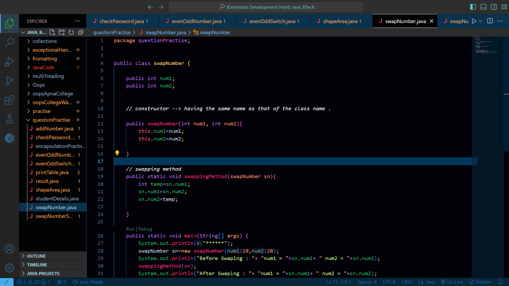

# jamuntheme  README

## best jamun dark theme for coders.

Welcome to the Jamun Dark Theme! Immerse yourself in the deep, dark, and soothing tones of Jamun, designed to provide an elegant and eye-friendly experience for your coding sessions, text editing, or any application interface that supports theme customization.

## Jamun Dark Theme (Preview)

## Features

* Deep Dark Background: Reduces eye strain during long coding sessions.

* Vibrant Syntax Highlighting: Carefully selected colors to distinguish between different syntax elements easily.

* Customizable: Adjust the theme to your liking, supporting various editors and IDEs.

* Wide Support: Compatible with numerous text editors, IDEs, and terminal emulators.

## Installation

Please follow the installation instructions specific to your text editor, IDE, or terminal emulator. Here are some installation steps:

### Visual Studio Code

1. Open the Extensions sidebar.
2. Search for "Jamun Dark Theme."
3. Click on the Install button.

## About Authors

* `Mohit Upadhyay` [Github Profile](https://github.com/Mohit5Upadhyay)

* `Anuj Kumar Upadhyay` [Github Profile](https://github.com/anuj123upadhyay)

## Contribute

**Feel Free to Contribute inorder to enhance the experience of Jamun Dark Theme**
[Github Repo](https://github.com/Mohit5Upadhyay/vscode-jamunDarkTheme)

**Enjoy!**
